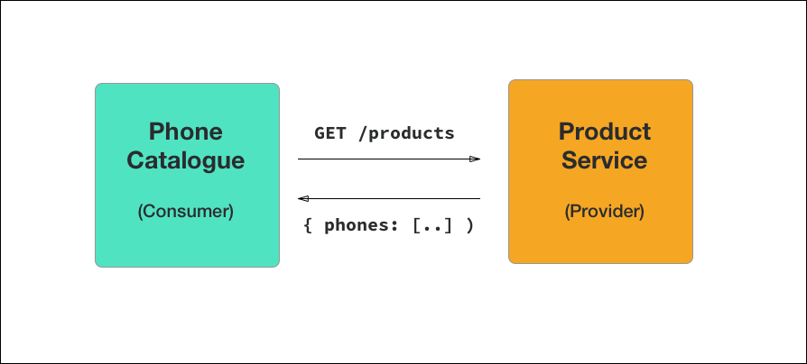

# Consumer-Driven Contract Tests
Modern web architecture is moving away from monoliths, patterns such as BFFs and micro services. In these modern patterns we have APIs being exposed, and as such it is very important to adopt a pattern of “Consumer-Driven Contract Tests”.

## Illustrating the problem
Let’s say you have applications: A phone catalogue page (the Client) and a Product API (the Provider).

If you don’t have tests in place you can break these interactions (or contracts).

Examples:
* Changing the URL of the endpoint (changing the URL from /products to /phones
* Change in required parameters
* Change in response payload

Sometimes the above changes are minor backwards-compatible changes, and sometimes these are major breaking changes. To be confident, this requires is testing for both the consumer and for the provider.

## Testing from the consumer side
The first step is for the consumer to generate a contract with the provider. This means that based on request sent, you expect a response of a certain payload.

You would then on a regular cadence (example: cron-job) make the actual request with the service and assert that the response matches your contract.

## Testing from the provider side
In an ideal scenario (when you have access to both the consumer and provider), the consumer would provide the contract to the provider. Then the provider would, in their pipeline, test against this contract. This makes sure that any code changes on the provider side does not break the contract they have with the consumer(s).
